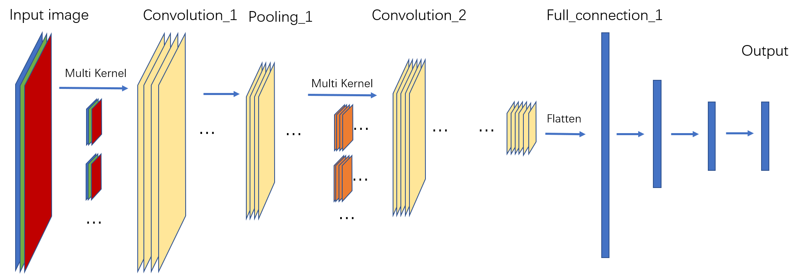
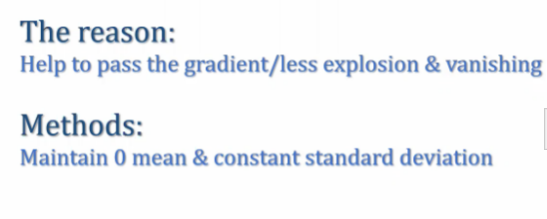
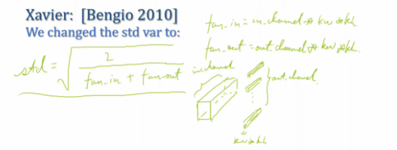

## CNN Layers

CNN网络主要包括卷积层、池化层、全连接层等。

### Convolution Layers

#### Single channel

**1.No padding**

给定一张5X5的单通道的灰度图像和一个3X3的卷积核，从左上角开始将对应位置的数字相乘再求和，kernel 依次滑动stride=1，计算得到右侧的结果；

输入输出的尺寸关系为：
$$
Width_{out} = \left \lfloor \frac{Width_{in}-Width_{kernel}}{strid} +1 \right \rfloor
$$
**2.Padding**

给定同样的一张5X5的单通道的灰度图像和一个3X3的卷积核，首先在图像边缘添加零值像素得到padding后的图像。

一般情况下：
$$
padding=\left \lfloor \frac{Width_{kernel}}{2} \right \rfloor
$$
从左上角开始将对应位置的数字相乘再求和，kernel 依次滑动stride=1，计算得到右侧的结果；

输入输出的尺寸关系为：
$$
Width_{out} = \left \lfloor \frac{Width_{in}+2 *padding -Width_{kernel}}{strid} +1 \right \rfloor
$$

#### Multi channel

对应与多通道的输入图像，就需要多通道的卷积核来分别对各个通道进行卷积计算然后再将三通道数据相加，输出仍为单通道，即一个卷积核对应一个输出。

要获得多个输出，就需要使用多个卷积核来对图像进行卷积计算。

### Pooling Layers

pooling的目的是在尽量保留关键信息的情况下缩小feature map的尺寸，从而减少运算量。

取前面卷积的输出中的一个channel为例进行大小为 2x2 的 maxpooling，即每四个元素中选出最大值。pooling前后的尺寸关系：
$$
Width_{out} =\left \lfloor \frac{Width_{in}}{Width_{pooling}} \right \rfloor
$$
除了 max pooling 外，还有average pooling、medium pooling 等。

#### Fully Connection Layers

全连接层就是与传统的神经网络一样，输入为一个特征向量，然后经过一系列的前向传播计算得到预测向量。因此卷积操作获得的feature map 要经过flatten操作转换为特征向量，然后再与参数weights进行相乘。

### Function Layers

#### Dropout

在全连接层中，特征向量的长度往往都是非常大的。这样在进行计算时就会有非常大的计算量，与此同时，在进行batch training时计算量就会很容易达到一个不能接受的程度。

为了降低训练时的计算负担，引入了dropout的方法，即在训练时随机的选取一部分参数（可采用将一部分参数置零的方式）进行训练。但是在进行预测时需要将所有参数计入计算范围。

#### Batch Normalization

图像数据的数据量一般都很大，为了改良数据的分布在一个batch 中对每一张图片进行normalization。

normalization的过程：
$$
Input:\ Batch \ value \ of\  X^{in}: \{x_1,x_2,x_3,...\}\\
Batch\ mean:\   \mu =\frac{1}{m}\cdot \sum_{i=1}^{m}x_i\\
Batch\ variance:\   \sigma^2 =\frac{1}{m}\cdot \sum_{i=1}^{m}(x_i- \mu)^2\\
Normalize\ X:\ x_i^{hat}=\frac{x_i-\mu}{\sigma}\\
Output: scale\ and\ shift\ X^{out}:x_i^{out}=\gamma x_i+\beta\\
$$

## Other Parts

### Initialization Methods 

#### Gaussian

gaussian distribution

#### Xavier

针对线性的或tanh激活函数，或不适用激活函数

修改标准差$\sigma=\sqrt\frac{2}{fan_{in}+fan_{out}}$

#### Kaiming

针对relu激活函数

修改标准差$\sigma=\sqrt\frac{2}{fan_{in}}$

### Image Preprocessing 

### Optimization

### Evaluation

### Learning Strategy

