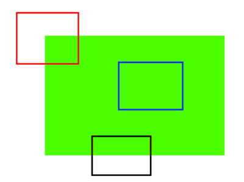
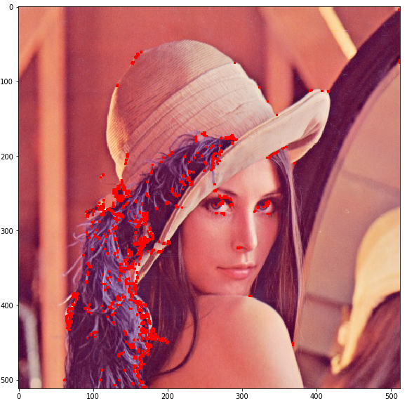

## Understanding Features

### What is Features

从信息角度来看，图像中的特征即是该图片所携带的信息，可以用来与其他的图像进行区分。

在下面的图像中，

1. 蓝色的窗口区域是一个均匀的色块，从中可以得到“绿色”信息（无法确定该窗口的位置）；
2. 黑色窗口区域是一个上下明显的分界，从中可以得到边缘的信息（能够从竖直方向确定该窗口的位置）；
3. 红色窗口区域是两个方向的分界的交点，从中可以得到角点的信息（能够从竖直和水平方向确定该窗口的位置）。



从这个例子中可以看出，在这幅图像中角点是一个good feature.而不同的图像中对于good feature的定义也是不相同的，上面的图像非常简单，携带的信息本身就很少所以一个简单的角点就能算是good feature，当图像携带的信息非常多时，就需要更具有代表性的特征来表示。

### Feature Detection

”特征识别“就是说，在上面的图像中我们如何找到边缘、角点。一个直观的思路就是将窗口在图像上滑动，观察两个方向上的变化情况。

- 若变化很小可视为平坦区域，即蓝色窗口区域；
- 若某个方向变化较大，可视为边缘区域，即黑色窗口区域；
- 若两个方向变化都很大，可视为角点区域，即红色窗口区域。

### Feature Description

“特征描述”就是说，在一幅图像中我们找到了一些good features，我们要用一些特殊的标记（向量等形式）来对这些特征进行描述。这样我们就能够使用这些标记在其他的图像中寻找是否有相同或相似的特征。

## Harris Corner Detection

角点是指在各个方向上灰度值变化都非常大的区域，灰度变化也就是灰度梯度。寻找角点也就是寻找灰度梯度最大的像素点。

我们使用一个窗口在图像上滑动来计算灰度的梯度 $E(u,v)$
$$
E(u,v)=\sum_{x,y}w(x,y)[I(x+u,y+v)-I(x,y)]^2
$$
其中$w(x,y)$为窗口函数，$I(x,y)$为某个像素点的灰度值，$I(x+u,y+v)$为窗口移动后的灰度值。

进行泰勒展开:
$$
E(u,v)=\sum_{x,y}w(x,y) [u,v]\begin{bmatrix} I_xI_x & I_xI_y\\I_xI_x & I_xI_y\end{bmatrix}\begin{bmatrix} u\\v\end{bmatrix}
$$
其中，$I_x,I_y$为灰度值在两个方向的梯度。[如何计算梯度](./Gradient.md)

令
$$
M=\sum_{x,y}w(x,y) \begin{bmatrix} I_xI_x & I_xI_y\\I_xI_x & I_xI_y\end{bmatrix}
$$
即
$$
E(u,v)=[u,v]M\begin{bmatrix} u\\v\end{bmatrix}
$$
这里使用一个便于计算的数值来判断窗口在滑动过程中是否出现角点，即
$$
R=det(M)-k (trace(M))^2
$$


- 当$|R|$很小时,表示平坦区域；
- 当$R<0$时,表示边缘区域；
- 当$R$很大时,表示角点区域；

可以使用OpenCV的 cv.cornerHarris() 可直接获得图像中每个位置像素点的计算结果R，同时指定一个合适的阈值就可以筛选出所需要的角点信息。

**Parameters：**

- **img** - Input image, it should be grayscale and **float32** type.
- **blockSize** - It is the size of neighbourhood considered for corner detection
- **ksize** - Aperture parameter of Sobel derivative used.
- **k** - Harris detector free parameter in the equation.

**实例代码：**

```python
img = cv.imread('lena.jpg')
img_gray = cv.cvtColor(img,cv.COLOR_BGR2GRAY)
# Input image should be grayscale and float32 type.
img_gray = np.float32(img_gray)
# the result of Harris Corner Detection is a grayscale image with these scores.
dst = cv.cornerHarris(img_gray,2,3,0.04)

#result is dilated for marking the corners, not important
dst = cv.dilate(dst,None)

# Threshold for an optimal value, it may vary depending on the image.
img[dst>0.01*dst.max()]=[0,0,255]
img_plt = cv.cvtColor(img,cv.COLOR_BGR2RGB)
plt.figure(figsize=(10,10))
plt.imshow(img_plt)
```

