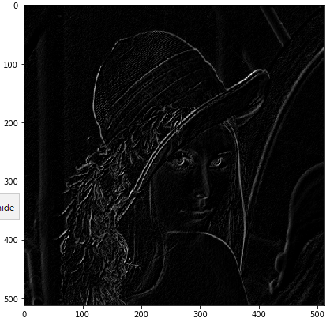

在图像特征提取中一个很重要的操作就是提取边缘，边缘是指在某个方向上梯度变化很大，而垂直方向上梯度变化很小。

以图像中坐标为$(x,y)$的像素点灰度值$I(x,y)$为函数。

### 梯度计算

在数学计算中，微分计算公式为：
$$
I_x = \frac {I(x+\delta x,y)-I(x,y)}{\delta x} \\
I_y = \frac {I(x,y+\delta y)-I(x,y)}{\delta y} \\
$$
在图像中，由于像素点坐标是离散的，最小间隔为1，所以这里我们用:$\delta x =1,\delta y=1$,则有：
$$
I_x = I(x+1,y)-I(x,y)\\
I_y = I(x,y+1)-I(x,y) \\
$$
要实现上面的计算过程，我们需要使用到OpenCV中的filter2D()方法，该方法使用一个kernel对图像进行卷积运算。（对应位置相乘再相加）

要实现上面的梯度计算，我们只需指定两个方向的卷积核：
$$
kernel_{height}=\begin{bmatrix} 0 & 0 & 0\\0 &-1 &0\\ 0 &1 &0 \end{bmatrix}\\
kernel_{width}=\begin{bmatrix} 0 & 0 & 0\\0 &-1 &1\\ 0 &0 &0 \end{bmatrix}
$$
**代码实现：**

```python
img = cv.imread('lena.jpg')
img = cv.cvtColor(img,cv.COLOR_BGR2RGB)
# 使用f(x+1)-f(x)
# height方向梯度
edge_height = np.array([[0, 0, 0]
                      , [0, -1, 0]
                      , [0, 1, 0]], np.float32)
# width方向梯度
edge_width = np.array([[0, 0, 0]
                    , [0, -1, 1]
                    , [0, 0, 0]], np.float32)

img_height = cv.filter2D(img_gray, -1, kernel=edge_height)
img_width = cv.filter2D(img_gray, -1, kernel=edge_width)
plt.figure(figsize=(15,24))
plt.subplot(1,2,1)
plt.imshow(img_width, cmap='gray')
plt.subplot(1,2,2)
plt.imshow(img_height, cmap='gray')
```


使用上面的方式能够提取出一些边缘信息，但结果明显不是很好。我们改变一下梯度求解方式：
$$
I_x = I(x+1,y)-I(x-1,y)\\
I_y = I(x,y+1)-I(x,y-1)
$$
要实现上面的梯度计算，我们只需改变两个方向的卷积核：
$$
kernel_{height}=\begin{bmatrix} 0 & -1 & 0\\0 &0 &0\\ 0 &1 &0 \end{bmatrix}\\
kernel_{width}=\begin{bmatrix} 0 & 0 & 0\\-1 &0 &1\\ 0 &0 &0 \end{bmatrix}
$$
**代码实现：**

```python
# 使用f(x+1)-f(x-1)
# 一般都采用这种方式
# height方向梯度
edge_height = np.array([[-1, -2, -1], [0, 0, 0], [1, 2, 1]], np.float32)

# width方向梯度
edge_width = np.array([[-1, 0, 1], [-2, 0, 2], [-1, 0, 1]], np.float32)

img_height = cv.filter2D(img, -1, kernel=edge_height)
img_width = cv.filter2D(img, -1, kernel=edge_width)
plt.figure(figsize=(12,24))
plt.subplot(1,2,1)
plt.imshow(img_width)
plt.subplot(1,2,2)
plt.imshow(img_height)
```


将两个方向的梯度求和，即可得到所要的边缘信息。

**代码实现：**

```python
# 两个方向梯度求和 (采用center=|edge_height|+|edge_width|)
edge = img_height+img_width
plt.figure(figsize=(7,7))
plt.imshow(edge, cmap='gray')
```



当然也可以直接使用OpenCV中的sobel()方法进行梯度计算。

用法：cv.Sobel(src, ddepth, dx, dy,ksize)

其中，ddepth为图像的灰度深度（如：cv.CV_8U）

这里我将两种方式进行了效果对比。

其中sobel的卷积核为
$$
kernel_{sobel}=\begin{bmatrix} -1 & 0 & 1\\-2 &0 &2\\ -1 &0 &1 \end{bmatrix}+\begin{bmatrix} -1 & -2 & -1\\0 &0 &0\\ 1 &2 &1 \end{bmatrix}=\begin{bmatrix} -2 & -2 & 0\\-2 &0 &2\\ 0 &2 &2 \end{bmatrix}
$$
**代码实现：**

```python
kernel_height = np.array([[-1, -2,-1], [0, 0, 0], [1, 2, 1]], np.float32)
kernel_width = np.array([[-1, 0, 1], [-2, 0, 2], [-1, 0, 1]], np.float32)

img_edge_height = cv.filter2D(img_gray, -1, kernel=kernel_height)
img_edge_width = cv.filter2D(img_gray, -1, kernel=kernel_width)

img_sobel_width = cv.Sobel(img_gray, cv.CV_8U, 1, 0)
img_sobel_height = cv.Sobel(img_gray, cv.CV_8U, 0, 1)

img_sobel = cv.filter2D(img_gray, -1, kernel=sobel_kernel)

plt.figure(figsize=(10,10))
plt.subplot(2,2,1)
plt.title('img_edge_width')
plt.imshow(img_edge_width, cmap='gray')
plt.subplot(2,2,2)
plt.title('img_sobel_height')
plt.imshow(img_sobel_height, cmap='gray')
plt.subplot(2,2,3)
plt.title('img_sobel_width')
plt.imshow(img_sobel_cv1, cmap='gray')
plt.subplot(2,2,4)
plt.title('img_sobel_height')
plt.imshow(img_sobel_cv2, cmap='gray')
```


可以看出，OpenCV的Sobel()方法得到的单方向的梯度结果与采用所给卷积核进行卷积计算的结果是相同的。

